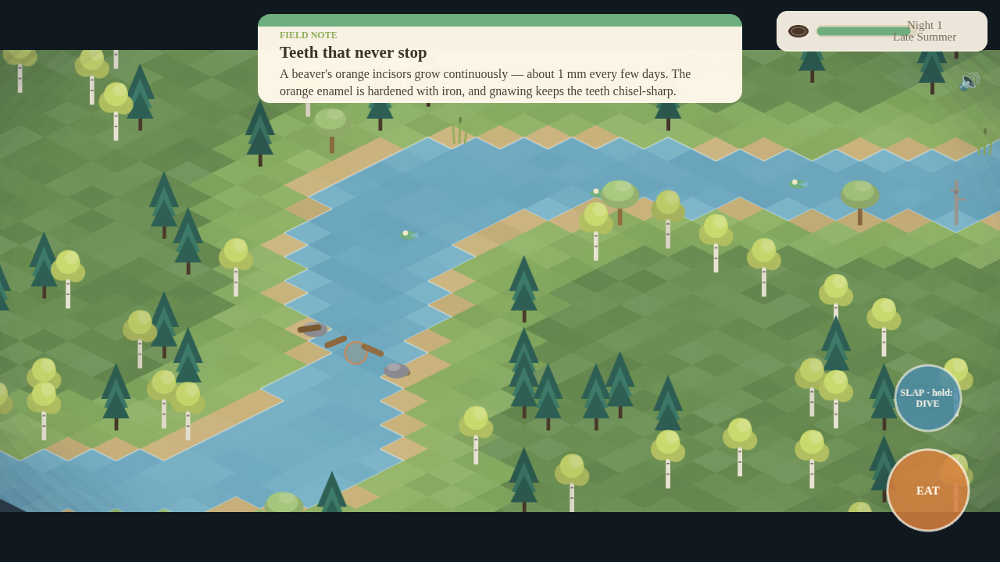
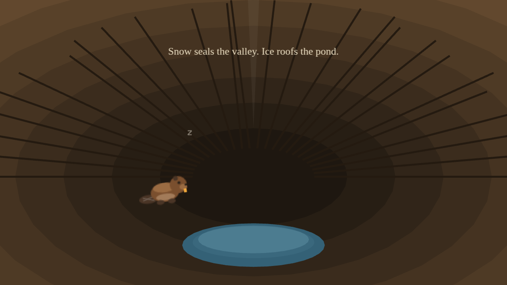
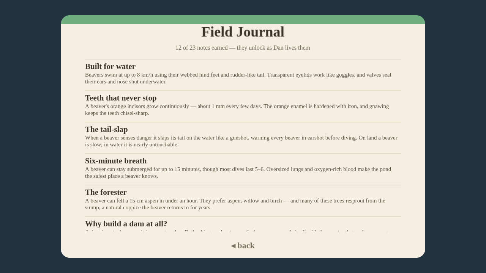

# Beaver Dan 🦫

*A river of your own.*

Beaver Dan is a free iOS/Android game about the real life of a beaver. You play Dan through dispersal and the founding of his own pond: swim, gnaw aspens, float logs down the current, raise a dam, watch the valley flood, dig canals, patch midnight leaks by ear, build a lodge, dodge wolves — and learn, just by playing, how beavers actually live. Donations from players go to beaver and wetland charities (90% to the charity you pick, 10% keeps the game alive).

Art direction: *Old Man's Journey* meets *Lumino City* — painterly, layered, handcrafted. Every visual **and every sound** is generated in code (procedural placeholders with the final painted/recorded style guide in [`docs/GAME_DESIGN.md`](docs/GAME_DESIGN.md)).

| | | |
|---|---|---|
|  |  |  |
|  |  |  |

## Play it now (prototype)

```bash
cd beaver-dan
npm install
npm run dev          # open the printed URL
```

**Controls**

| | Keyboard | Touch |
|---|---|---|
| Move | WASD / arrows | drag on the left half |
| Context action (gnaw, take/build, eat, patch, dig, enter) | hold **Space/E** | hold the orange button |
| Tail-slap | tap **Q/Shift** afloat | tap the blue button |
| Dive | hold **Q/Shift** in deep water | hold the blue button |

**The loop:** find the narrows downstream → fell aspens (fell them *by the water* and the current floats the logs to the dam for you) → raise the dam stage by stage — the camera lifts away as the water genuinely sweeps across the valley, tile by tile → dig canals to float wood from far tree stands → patch the leak that springs at dusk (you locate it by the sound of trickling water) → build a lodge, eat well, swim up through its underwater door, and sleep before winter.

Wolves hunt at night — **and they wade**: the shallows are lunge range, only the deep water your dam created is safe. Tail-slap to send them running, or dive and vanish on one held breath. From the third night they hunt in pairs.

*Field Notes* — 23 short, true beaver facts — unlock the first time you do each thing and are archived forever in the **Field Journal** on the title screen.

## What's in this prototype

- Third-person isometric open valley with a terrain-driven flood model: the dam raises the actual water table; drowned trees become habitat snags; new shallows grow lilies
- **Staged flood cinematic** — letterboxed camera pull-out while the pond spreads and snags gray in one by one
- **Dam maintenance loop**: a leak springs at dusk, audible as a spatialized trickle that grows louder as you close in; unpatched leaks tear wider overnight and drop the pond a stage
- **Log floating & canal digging** — fell trees by water and the current delivers; dig channels to bring far timber into the network
- **Tail-slap and dive verbs** with breath meter; wolves that wade, lunge, flee from slaps, and lose a submerged beaver
- **Procedural audio** (WebAudio, zero assets): river ambience, escalating gnaw crunches, tree-fall, splashes, the tail-slap crack, the leak trickle, wolf growls, field-note chimes, dawn/dusk piano stings and a title motif
- **Save system** — autosaves at every meaningful beat plus a rolling timer; CONTINUE on the title screen
- First-person scenes: the interactive swim **up through the lodge's underwater entrance**, the chamber, sleep, and the winter epilogue
- Story prologue covering kit-hood and dispersal; day/night cycle; energy/foraging; "close call" predation outcomes
- **Field Journal** archiving all unlocked notes across runs
- Donation screen (charity list; payment rails land with the store release)
- **Native iOS and Android projects** scaffolded with Capacitor (`android/`, `ios/`) — open in Android Studio / Xcode and run

## Builds & tests

```bash
npm run build            # type-check + production bundle (dist/)
node scripts/smoke.mjs   # headless Chromium full playthrough with assertions:
                         # title → story → play → slap/dive → 4 flood cinematics →
                         # leak patch → canal dig → save/reload/continue →
                         # lodge tunnel → epilogue → journal
```

Native builds (projects are committed; web assets sync in):

```bash
npm run cap:sync         # build + copy into android/ and ios/
npx cap open android     # or open ios — then run from the IDE
```

## Repository layout

```
beaver-dan/
├── docs/GAME_DESIGN.md   # full design doc: a beaver's life → 10 chapters of play
├── android/  ios/        # Capacitor native projects
├── src/
│   ├── world.ts          # valley terrain, stream, elevation, flood model, canals
│   ├── art.ts            # procedural painterly textures
│   ├── audio.ts          # procedural WebAudio sound + music
│   ├── facts.ts          # the Field Notes (educational content)
│   ├── save.ts           # autosave + field journal persistence
│   ├── chapters.ts       # objective chain
│   ├── entities/         # Dan (swim/walk/dive), wolves (wade/lunge/flee)
│   └── scenes/           # Boot, Title, Story, Game, Lodge, UI, Journal, Donate
└── scripts/smoke.mjs     # headless end-to-end test
```
