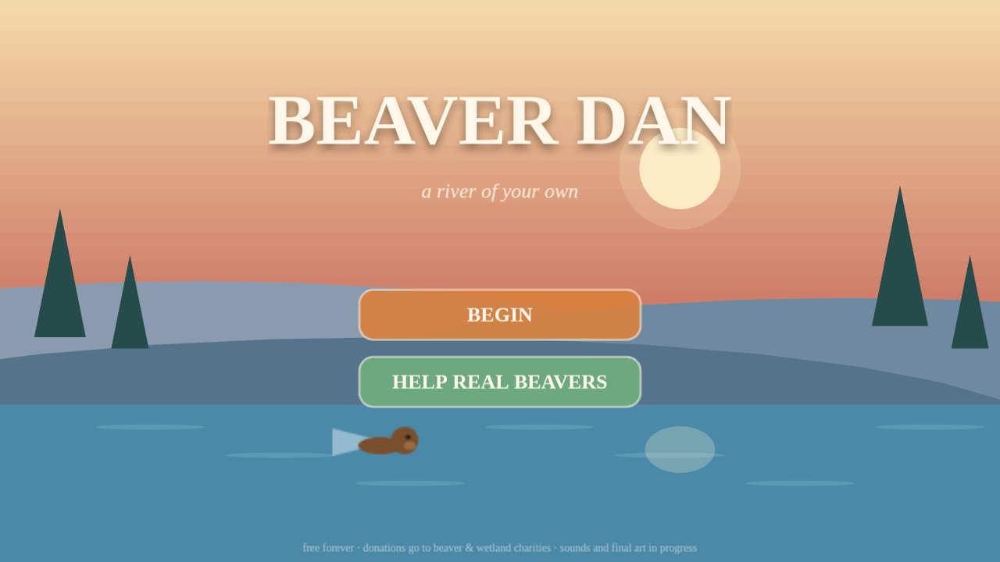
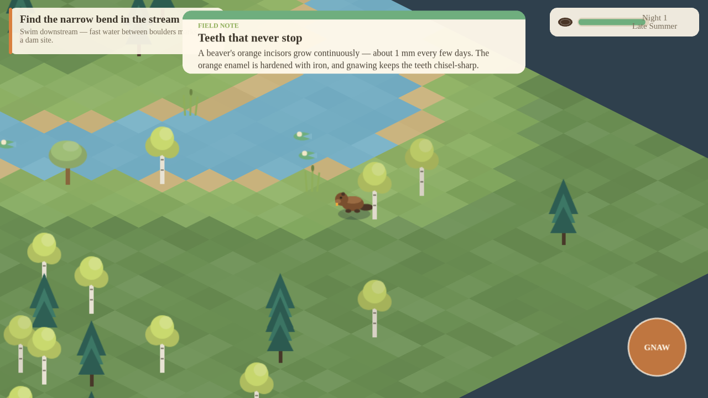
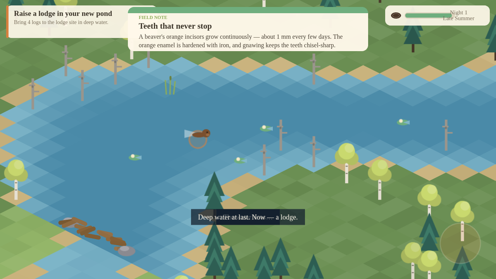

# Beaver Dan 🦫

*A river of your own.*

Beaver Dan is a free iOS/Android game about the real life of a beaver. You play Dan through dispersal and the founding of his own pond: swim, gnaw aspens, float logs to the narrows, raise a dam, watch the valley flood, build a lodge, dodge the wolf, and learn — just by playing — how beavers actually live. Donations from players go to beaver and wetland charities (90% to the charity you pick, 10% keeps the game alive).

Art direction: *Old Man's Journey* meets *Lumino City* — painterly, layered, handcrafted. The current visuals are procedural placeholders generated in code, with the final painted style guide in [`docs/GAME_DESIGN.md`](docs/GAME_DESIGN.md).

| | | |
|---|---|---|
|  |  |  |

## Play it now (prototype)

```bash
cd beaver-dan
npm install
npm run dev          # open the printed URL
```

**Controls:** WASD / arrow keys to move, **Space/E** for the context action (gnaw, take log, build, eat, enter lodge). On touch: drag on the left half to swim/walk, hold the right-side button to act.

**The loop:** find the narrows downstream → fell 3 aspens → float 8 logs to the dam (the water genuinely rises, tile by tile) → build a lodge in your new deep water → eat well and sleep before winter. A wolf hunts at night; deep water is the only safe place. *Field Notes* — short, true beaver facts — unlock the first time you do each thing.

## What's in this prototype

- Third-person isometric open valley with a terrain-driven flooding model (the dam raises the actual water table; drowned trees become habitat snags)
- First-person scenes: lodge interior, sleep, and the winter epilogue
- Story prologue covering Dan's kit-hood and dispersal (chapters 1–3 in vignette form; fully playable versions are on the [roadmap](docs/GAME_DESIGN.md#9-milestones))
- Day/night cycle, energy/foraging, wolf predation with "close call" outcomes
- 20 action-triggered educational Field Notes
- Donation screen (charity list; payment rails land with the store release)
- All art generated procedurally from a single palette — zero binary assets

## Builds & tests

```bash
npm run build        # type-check + production bundle (dist/)
node scripts/smoke.mjs   # headless Chromium playthrough; fails on any runtime error
```

iOS / Android via Capacitor:

```bash
npm i @capacitor/core @capacitor/cli @capacitor/ios @capacitor/android
npm run cap:add:ios && npm run cap:add:android
npm run cap:sync     # then open the native projects in Xcode / Android Studio
```

## Repository layout

```
beaver-dan/
├── docs/GAME_DESIGN.md   # full design doc: a beaver's life → 10 chapters of play
├── src/
│   ├── world.ts          # valley terrain, stream, elevation, flood model
│   ├── art.ts            # procedural painterly textures
│   ├── facts.ts          # the Field Notes (educational content)
│   ├── chapters.ts       # objective chain
│   ├── entities/         # Dan, the wolf
│   └── scenes/           # Boot, Title, Story, Game, Lodge, UI, Donate
└── scripts/smoke.mjs     # headless end-to-end test
```
